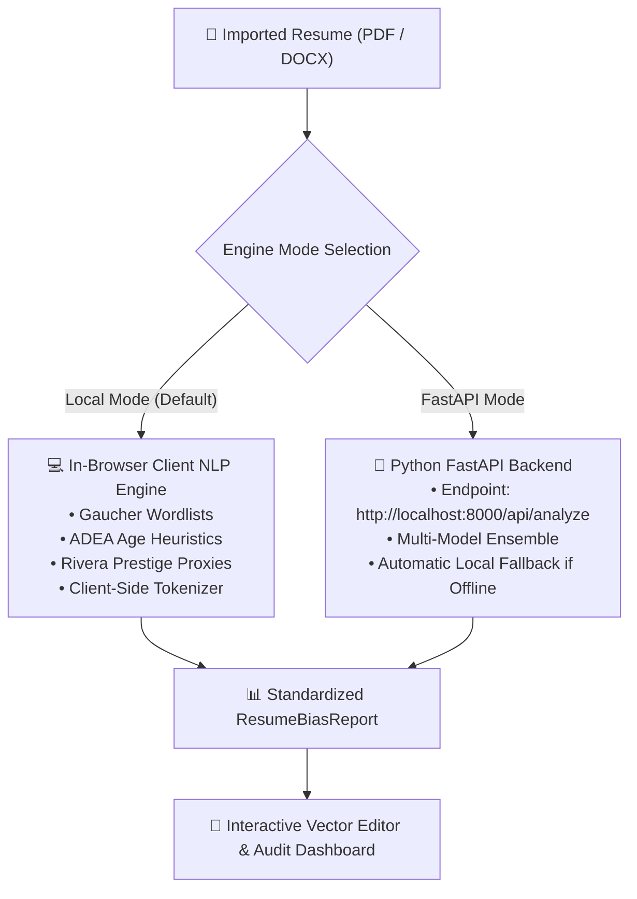

# 🔍 BiasLens — Resume Intelligence & Fairness Studio

<div align="center">


[](https://react.dev/)
[](https://www.typescriptlang.org/)
[](https://vitejs.dev/)
[](https://tailwindcss.com/)
[](LICENSE)

**An AI-driven resume bias detection, fairness auditing, and layout-preserving Canva/Figma canvas editor.**

[Key Features](#-key-features) • [Engine Architecture](#-analysis-engine-architecture) • [Getting Started](#-getting-started) • [Canvas Shortcuts](#-canvas-shortcuts) • [Project Structure](#-project-structure) • [Research & Methodology](#-research--methodology)

</div>

---

## 💡 Overview

Modern recruitment algorithms and automated Applicant Tracking Systems (ATS) frequently replicate unconscious human biases. Subtle linguistic cues, graduation year ranges, institutional prestige markers, and employment gap phrasing can trigger systematic demographic penalties during automated screening.

**BiasLens** provides candidates and hiring professionals with an end-to-end fairness and layout studio:

1. **Linguistic & Structural Bias Auditing:** Identifies gender-coded language, age indicators, prestige proxies, disability framing, and career gap markers grounded in peer-reviewed psycholinguistic research.
2. **Counterfactual Fairness Simulation:** Calibrates demographic parity and evaluates disparate impact ratios against the EEOC $80\%$ (Four-Fifths) rule across simulated candidate variations.
3. **Interactive Design Editor:** Converts imported PDFs and DOCX files into full-fidelity Canva/Figma-style vector textboxes with magnetic auto-docking, alignment guidelines, rich typography, and layout preservation.
4. **Dual Engine Flexibility:** Run privately 100% in-browser via client-side NLP or connect to a remote Python FastAPI backend for high-throughput multi-model inference.
5. **Zero-Retention Privacy by Default:** All text parsing, NLP heuristics, and document modifications run in-memory with customizable local storage retention.

---

## ✨ Key Features

### 🎨 Canva / Figma Style Resume Canvas

- **High-Fidelity PDF Clustering:** Automatically detects two-column splits, extracts exact $(x, y)$ coordinates, preserves font baselines, and recovers true RGB text colors from the PDF operator stream.
- **Auto-Docking & Magnetic Snapping:** Text frames snap to page margins, horizontal/vertical page centers, and sibling blocks with visible pink alignment guidelines.
- **Marquee & Multi-Select:** Left-click and drag on the canvas sheet to marquee-select multiple frames. Move, style, or delete them collectively with a unified bounding box.
- **Typography & Font Choices:** Supports curated typefaces (`Poppins`, `Inter`, `Montserrat`, `Roboto`, `Lato`, `EB Garamond`, `Merriweather`, `Calibri`) with direct point-size typing and alignment controls.
- **History Stack & Navigation:** Complete Undo/Redo (`Ctrl+Z`, `Ctrl+Y`), Arrow key nudging, and Spacebar pan navigation.

### ⚖️ BiasLens Intelligence Engine

- **5 Core Bias Dimensions:**
  - ♀️ / ♂️ **Gender-Coded Phrasing** (Gaucher et al. Agentic vs. Communal taxonomy)
  - ⏳ **Age Proxies** (Graduation dates, outdated software stacks, tenure framing)
  - 🏛️ **Prestige Indicators** (Elite university bias, non-predictive pedigree filters)
  - ⏱️ **Career Gap Framing** (Vulnerability signals vs. neutral professional phrasing)
  - ♿ **Disability & Health Proxies**
- **Actionable Neutral Rewrites:** Single-click application of calibrated rewrites directly onto the canvas text frames without layout distortion.
- **Live Neutrality Index:** Real-time $0 - 100$ score counter reflecting the cumulative bias exposure of the current draft.
- **Seamless Filter Navigation:** Instant category filtering with a clean, scrollbar-free header bar.

### 📊 Fairness Auditing & Benchmark Tools

- **Counterfactual Testing:** Simulates demographic perturbations (gender pronouns, graduation years, institution names) to calculate baseline disparate impact ratios.
- **Empirical Evaluation Benchmarks:** Built-in review of model performance, precision/recall metrics, and ablation studies across technical and business resumes.
- **Ethics & Methodology Documentation:** Interactive ethical framework grounded in EEOC and academic compliance standards.

### 📥 Comprehensive Export Options

- **Print-Ready PDF Document:** Vector-preserving single and multi-page resume export.
- **High-Resolution Images:** Export to clean PNG or compressed JPEG formats.
- **Audit Data:** Download plain text versions or complete JSON bias reports for compliance documentation.

### ⚙️ Account, Engine & Privacy Settings

- **Analysis Engine Switcher:** Easily configure your intelligence provider in the dedicated Settings tab:
  - **Local (In-Browser):** Zero network latency, 100% offline-capable, complete data privacy.
  - **FastAPI Backend:** Targeted at `http://localhost:8000/api/analyze` with built-in connection ping testing.
- **Interactive Notifications:** Clean, dismissible toast notifications with cross close buttons.
- **Account & Security:** Profile customization, simulated Google OAuth, data retention policies, and session caching controls.

---

## ⚙️ Analysis Engine Architecture

BiasLens features a modular dual-engine design configured under **Account & Settings → Analysis Engine**:



---

## ⌨️ Canvas Shortcuts

| Shortcut                        | Action                                          |
| :------------------------------ | :---------------------------------------------- |
| `Ctrl + B` / `⌘ + B`            | Toggle **Bold**                                 |
| `Ctrl + I` / `⌘ + I`            | Toggle _Italic_                                 |
| `Ctrl + U` / `⌘ + U`            | Toggle <u>Underline</u>                         |
| `Ctrl + Shift + L`              | Align **Left**                                  |
| `Ctrl + Shift + E`              | Align **Center**                                |
| `Ctrl + Shift + R`              | Align **Right**                                 |
| `Ctrl + Shift + J`              | Align **Justify**                               |
| `Ctrl + Z` / `⌘ + Z`            | **Undo**                                        |
| `Ctrl + Y` / `Ctrl + Shift + Z` | **Redo**                                        |
| `Ctrl + D` / `⌘ + D`            | **Duplicate** Selected Block(s)                 |
| `Delete` / `Backspace`          | **Delete** Selected Block(s)                    |
| `Arrow Keys`                    | Nudge $1\text{pt}$ ($10\text{pt}$ with `Shift`) |
| `Spacebar + Drag`               | Pan / Hand Tool                                 |

---

## 📁 Project Structure

```
biaslens/
├── planning/                     # Project specs, revision metadata, and design plans
│   ├── project.json
│   └── plan/
├── public/                       # Favicons, fonts, and static assets
├── src/
│   ├── components/
│   │   ├── account-settings-modal.tsx  # Settings modal (Profile, Engine, Theme, Privacy)
│   │   ├── auth-modal.tsx              # Sign In, Sign Up, and Google OAuth modal
│   │   ├── ethics-modal.tsx            # Ethics guidelines and methodology modal
│   │   ├── evaluation-benchmark-modal.tsx # Precision/Recall & ablation benchmarks
│   │   ├── fairness-audit-modal.tsx    # Counterfactual disparate impact simulation
│   │   ├── figma-resume-editor.tsx     # Canvas workspace with snapping & bounding box
│   │   ├── resume-workspace.tsx        # Main application layout, header & sidebars
│   │   └── ui/                         # shadcn/ui components (Sonner, Dialog, Button, etc.)
│   ├── lib/
│   │   ├── analysis-service.ts         # Dual engine abstraction & fallback handling
│   │   ├── auth-context.tsx            # Authentication state and profile management
│   │   ├── bias-taxonomy.ts            # Research taxonomy rules & scoring heuristics
│   │   ├── pdf-cluster-engine.ts       # Coordinate extraction, RGB reader & line clusterer
│   │   ├── resume-contract.ts          # TypeScript interfaces and normalization schemas
│   │   └── theme.ts                    # Dark / Light / System theme provider
│   ├── routes/                         # TanStack Router page layouts and root providers
│   └── styles.css                      # Tailwind v4 configuration, theme colors & utilities
├── package.json
└── vite.config.ts
```

---

## 🚀 Getting Started

### Prerequisites

- [Node.js](https://nodejs.org/) (v18.0.0 or higher)
- npm or bun

### Installation

```bash
# Clone the repository
git clone https://github.com/YOUR_USERNAME/biaslens.git

# Navigate into the project directory
cd biaslens

# Install dependencies
npm install

# Start local development server
npm run dev
```

Visit `http://localhost:8080/` in your browser.

### Available Scripts

- `npm run dev` — Starts the Vite development server with hot-module replacement.
- `npm run build` — Compiles optimized production client and server bundles.
- `npm run preview` — Locally previews the generated production build.
- `npm run lint` — Runs ESLint across TypeScript and JSX sources.
- `npm run format` — Enforces Prettier code style standards across the codebase.

---

## 🔬 Research & Methodology

BiasLens scoring heuristics and counterfactual models are grounded in peer-reviewed literature:

- **Gaucher, Friesen, & Kay (2011):** _Evidence That Gendered Wording in Job Advertisements Exists and Sustains Gender Inequality._ Journal of Personality and Social Psychology.
- **EEOC Uniform Guidelines (29 C.F.R. § 1607.4D):** _The Four-Fifths (80%) Rule for Evaluating Disparate Impact in Selection Procedures._
- **Bertrand & Mullainathan (2004):** _Are Emily and Greg More Employable Than Lakisha and Jamal? A Field Experiment on Labor Market Discrimination._ American Economic Review.
- **Rivera, Lauren A. (2012):** _Hiring as Cultural Matching: The Case of Elite Professional Service Firms._ American Sociological Review.

---

## 🔒 Privacy & Data Ethics

- **Zero Data Retention:** No resume text, contact information, or file bytes are transmitted to third-party ad networks or tracking brokers.
- **Client-Side Processing:** All PDF text rendering and baseline scoring execute directly inside the user's browser runtime.
- **Configurable Persistence:** Users may choose between persistent local caching, session-only storage, or zero-retention RAM operation in **Privacy Settings**.

---

## 📄 License

This project is licensed under the MIT License — see the [LICENSE](LICENSE) file for details.
